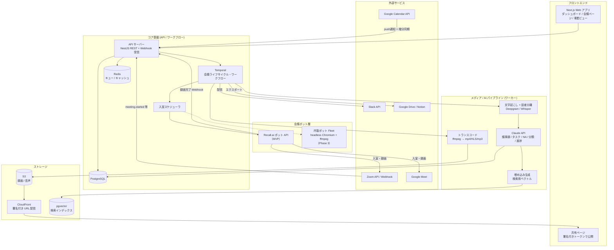

# 02. システムアーキテクチャ

## 1. 全体構成図



## 2. コンポーネント責務

### 2.1 API サーバー（NestJS / TypeScript）

- 認証（Auth.js + Google OAuth）、ワークスペース / RBAC
- REST API（フロント向け）+ Webhook 受信（Google Calendar push, Zoom, Recall.ai, Slack）
- Webhook は**検証 → DB 記録 → Temporal へシグナル**だけを行い、重い処理は持たない（冪等性キーで重複排除）

### 2.2 カレンダー同期サービス

- Google Calendar の **watch チャンネル**（push 通知）+ **incremental sync**（syncToken）で予定を準リアルタイム同期
- 予定本文 / conferenceData から会議 URL を抽出（Meet: `conferenceData.entryPoints`、Zoom: URL 正規表現 `zoom.us/j/{id}`）
- 抽出した会議ごとに `meetings` レコードを upsert し、入室ポリシー（F-04）を評価して参加要否を決める
- watch チャンネルは最長 ~7 日で失効するため、**失効前更新の定期ジョブ**を持つ

### 2.3 会議ライフサイクル・ワークフロー（Temporal）

会議 1 件 = 1 ワークフローインスタンス。状態遷移を一元管理する。

```
scheduled → joining → waiting_room → recording → ended
                                        ↓
                    processing(transcode → stt → llm) → delivered
（各段で失敗時リトライ / 補償処理 / 人間へのエスカレーション）
```

Temporal を使う理由:
- 「開始 5 分前に起動 → 入室待ち → 数時間録画 → 後処理 → 配信」という**長時間・多段・失敗しうる**処理そのもの
- リトライ、タイマー（待機室タイムアウト）、外部イベント待ち（Recall Webhook をシグナルで受ける）が宣言的に書ける
- 会議の現在状態が常に問い合わせ可能（ダッシュボードの「Bot 入室中」表示に使う）

### 2.4 会議ボット層

**MVP: Recall.ai（または同等のボット API）を採用。**

| 観点 | Recall.ai 採用（MVP） | 内製（Phase 3 で検討） |
|---|---|---|
| 実装コスト | 数日（REST でボット作成 → 録画 URL 受領） | 数ヶ月（下記参照） |
| 対応範囲 | Meet / Zoom / Teams 済み。UI 変更追従もベンダー側 | 自前で追従が必要（Meet の DOM 変更リスク大） |
| 変動費 | ~$0.7–1.0/録画時間 | インフラ費のみ（~$0.05–0.2/時間）+ 運用人件費 |
| データ経路 | 録画が一時的にベンダーを経由 | 完全に自社内 |

内製時の構成（設計だけ先に固定しておく）: 1会議 = 1 Fargate/Fly Machine コンテナ。Xvfb 仮想ディスプレイ + PulseAudio null-sink 上で Chromium が Meet/Zoom Web クライアントにボットアカウントでログイン・入室し、ffmpeg が画面 + 音声をキャプチャ。DOM 監視でアクティブスピーカー・参加者の入退室イベントを取得し、話者マッピングに利用する。**ボット層は `BotProvider` インターフェースで抽象化し、Recall → 内製の差し替えをパイプラインに波及させない。**

### 2.5 メディア / AI パイプライン

- **Transcode ワーカー**: ffmpeg で mp4（再生用）+ HLS（シーク用）+ mp3（STT 用）を生成し S3 へ
- **STT ワーカー**: Deepgram（`nova-2`, 日本語, diarization + word timestamps）。フォールバックに Whisper large-v3。カスタム辞書は keyword boosting で注入
- **LLM ワーカー**: Claude API。詳細は [05-ai-pipeline.md](./05-ai-pipeline.md)
- **Embed ワーカー**: トランスクリプトのチャンク + 議事録を埋め込み、pgvector へ（Phase 3 の検索用。テーブルだけ最初から用意）

### 2.6 配信サービス

- 共有リンク: `share_links` にトークン発行 → 共有ページは録画を CloudFront 署名付き URL で再生（期限・パスワード・範囲は共有ページ側で制御）
- 通知: Slack Bot（事業チャンネルへ投稿）、メール（SES）
- エクスポート: Google Drive（事業ごとの指定フォルダへ mp4 + 議事録 doc）、Notion（Phase 2）

## 3. 技術スタック（推奨）

| レイヤ | 技術 | 補足 |
|---|---|---|
| モノレポ | Turborepo + pnpm | `apps/web`, `apps/api`, `apps/workers`, `packages/shared` |
| フロント | Next.js (App Router) + TypeScript + Tailwind + shadcn/ui | 共有ページは SSR で OGP 対応 |
| API | NestJS + Zod (OpenAPI 自動生成) | Webhook 受信も同居（薄く） |
| ワークフロー | Temporal (Temporal Cloud 推奨) | ワーカーは TypeScript SDK |
| DB | PostgreSQL (RDS or Supabase) + Prisma | pgvector 拡張 |
| キュー/キャッシュ | Redis (ElastiCache) | 軽いジョブと rate limit 用 |
| ストレージ | S3 + CloudFront | SSE-KMS、ライフサイクルで低頻度層へ |
| ボット | Recall.ai → (Phase 3) ECS Fargate 内製 Fleet | `BotProvider` 抽象 |
| STT | Deepgram / Whisper | 日本語 + diarization |
| LLM | Claude API（Sonnet + Haiku） | 構造化出力は tool use (JSON Schema) で強制 |
| 認証 | Auth.js + Google OAuth | Google 連携と同一同意フローに統合 |
| IaC / デプロイ | Terraform + GitHub Actions | web は Vercel でも可 |
| 監視 | Sentry + OpenTelemetry + Grafana | KPI: 入室成功率 / 議事録配信 p95 |

## 4. マルチテナントと権限

- 全テーブルに `workspace_id` を持たせる Pool 型マルチテナント。Prisma ミドルウェアで `workspace_id` を強制付与し、越境クエリをコードレベルで遮断
- ロール: **Owner**（課金・削除）/ **Admin**（連携・ポリシー設定）/ **Member**（自分の会議 + 所属事業）/ **Guest**（共有リンク経由の閲覧のみ）
- 会議の可視性: `workspace`（全員）/ `business`（事業メンバー）/ `private`（参加者のみ）の 3 段階。デフォルトは事業単位

## 5. セキュリティ設計の要点

- OAuth トークン（Google / Zoom / Slack）は専用テーブルに KMS 封筒暗号化で保存。アプリログへのトークン出力を lint で禁止
- Webhook は全て署名検証（Zoom: secret token, Recall: HMAC, Google: channel token）
- 共有リンクは推測不能トークン（128bit）+ 失効管理。録画本体の URL は共有ページ経由でしか取得できない（S3 直リンクは常に短命署名付き）
- 削除要求: 会議単位・事業単位・ワークスペース単位の削除で S3 / DB / ベクトル / エクスポート先を非同期一括削除（削除ジョブも Temporal で保証）
