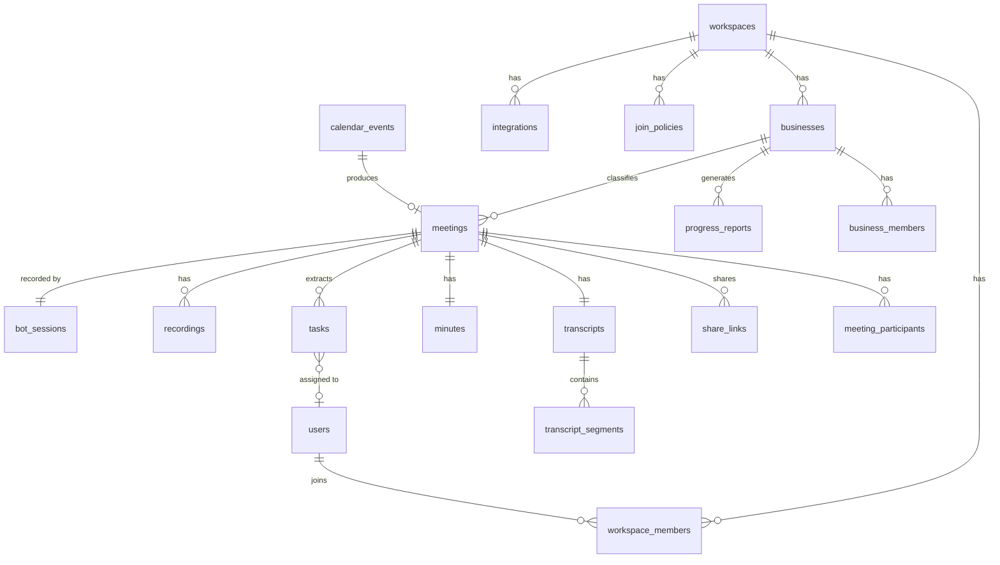

# 03. データモデル

## 1. ER 図（主要エンティティ）



## 2. テーブル定義（抜粋・主要カラムのみ）

### workspaces / users / workspace_members

```sql
workspaces(id, name, plan, retention_days, created_at)
users(id, email, name, avatar_url, created_at)
workspace_members(workspace_id, user_id, role)  -- role: owner/admin/member
```

### integrations — 外部連携とトークン

```sql
integrations(
  id, workspace_id, user_id,          -- user_id あり: 個人カレンダー等 / null: ワークスペース連携(Slack等)
  provider,                           -- google_calendar / zoom / slack / google_drive / notion
  encrypted_credentials,              -- KMS 封筒暗号化した OAuth トークン
  scopes, status,                     -- active / revoked / error
  sync_state jsonb                    -- syncToken, watch channel id/expiry など
)
```

### businesses — 事業（本アプリの中核概念）

```sql
businesses(
  id, workspace_id, name, description,
  keywords text[],                    -- 分類ヒント（例: {"ANTAI", "給付金", "LP"}）
  related_domains text[],             -- 参加者メールドメインによる分類ヒント
  slack_channel_id, drive_folder_id,  -- 配信・エクスポート先
  report_schedule,                    -- 進捗レポート周期 (weekly/biweekly/none)
  status                              -- active / archived
)
business_members(business_id, user_id, role)
```

### calendar_events / meetings — 予定と会議

```sql
calendar_events(
  id, workspace_id, integration_id,
  provider_event_id, ical_uid,        -- 繰り返し予定の展開に対応
  title, description, start_at, end_at,
  attendees jsonb,                    -- [{email, name, response}]
  conference_url, conference_provider, -- meet / zoom
  raw jsonb, synced_at
)

meetings(
  id, workspace_id, business_id,      -- business_id は分類後に設定（null = 未分類インボックス）
  calendar_event_id,                  -- null = 突発会議 (Zoom webhook / 手動URL)
  title, scheduled_start_at, actual_start_at, ended_at,
  conference_url, provider,
  status,          -- scheduled/joining/waiting_room/recording/ended/processing/delivered/failed/skipped
  join_decision,   -- auto_join / policy_skipped / user_skipped / manual_invite
  classification_confidence numeric,  -- 事業分類の確信度
  visibility       -- workspace / business / private
)
meeting_participants(meeting_id, email, display_name, user_id, spoke_seconds)
```

### bot_sessions / recordings — ボットと録画

```sql
bot_sessions(
  id, meeting_id, provider,           -- recall / self_hosted
  provider_bot_id, temporal_workflow_id,
  joined_at, admitted_at, left_at,
  status, failure_reason,             -- not_admitted / kicked / meeting_not_found / error
  events jsonb                        -- 入退室・アクティブスピーカーのイベントログ
)

recordings(
  id, meeting_id, kind,               -- video_mp4 / hls / audio_mp3
  s3_key, duration_seconds, size_bytes, status
)
```

### transcripts / transcript_segments — 文字起こし

```sql
transcripts(id, meeting_id, language, stt_provider, status, word_count)

transcript_segments(
  id, transcript_id, idx,
  speaker_label,                      -- diarization の話者ID (SPEAKER_00 等)
  speaker_name,                       -- 参加者マッピング後の表示名
  start_ms, end_ms, text,
  embedding vector(1024)              -- pgvector（Phase 3 検索用）
)
```

### minutes / tasks — 議事録とタスク

```sql
minutes(
  id, meeting_id, version,            -- 手動編集で version が増える
  summary_md,                         -- 全体サマリ（Markdown）
  structured jsonb,                   -- 下記スキーマ（決定事項/論点/保留/NA）
  edited_by, created_at
)
-- structured のスキーマ:
-- {
--   "decisions":   [{"text", "context", "segment_ids"}],
--   "discussions": [{"topic", "summary", "conclusion", "segment_ids"}],
--   "pending":     [{"text", "reason", "segment_ids"}],
--   "next_agenda": [{"topic", "why", "carried_over_from_task_id?"}]
-- }

tasks(
  id, workspace_id, meeting_id, business_id,
  title, description,
  assignee_user_id, assignee_name_raw, -- ユーザー突合できない場合は生テキスト保持
  due_date, priority,
  status,                             -- open / done / cancelled / carried_over
  source_segment_ids bigint[],        -- 根拠発言へのリンク（動画ジャンプに使用）
  external_ref jsonb                  -- Notion/Asana 同期用 (Phase 2)
)
```

### share_links / progress_reports / join_policies

```sql
share_links(
  id, meeting_id, token,              -- 128bit ランダム
  scope,                              -- minutes_only / minutes_and_recording
  password_hash, expires_at, revoked_at,
  view_count, created_by
)

progress_reports(
  id, business_id, period_start, period_end,
  content_md,                         -- 今週の動き/決定/進捗/リスク/来週
  source_meeting_ids uuid[],
  delivered_to jsonb                  -- slack/email の配信結果
)

join_policies(
  id, workspace_id, user_id,          -- user_id null = ワークスペース既定
  mode,                               -- all / own_only / internal_only / calendar_list / off
  exclude_patterns text[],            -- タイトル/参加者の除外条件（例: "1on1", "面接"）
  announce_recording boolean
)
```

## 3. 設計上の注意点

- **未分類インボックス**: `meetings.business_id = null` を「インボックス」として UI に出す。手動振り分けの結果は `classification_feedback`（meeting_id, suggested, corrected）に記録し、分類プロンプトの few-shot に還元する。
- **繰り返し予定**: `ical_uid` + 開催回で一意化。定例会議は同じ `business_id` を引き継ぐ（分類の強いヒントになる）。
- **話者マッピング**: diarization の `speaker_label` と、ボットが取得するアクティブスピーカーイベント（時刻 + 参加者名）を突き合わせて `speaker_name` を確定する。突合できない話者は「話者A」のまま表示し、UI で手動リネーム可能（リネームは同一人物の全セグメントに反映）。
- **タスクの持ち越し**: 次回会議の議事録生成時に、同一事業の `status=open` タスクをプロンプトに入れ、進捗言及があれば `done` 候補としてサジェスト。放置タスクは `carried_over` として NA に自動掲載する。
- **削除と保持**: `workspaces.retention_days` を過ぎた録画は S3 ライフサイクル + 削除ジョブで消し、議事録のみ残す（設定で全削除も可）。
