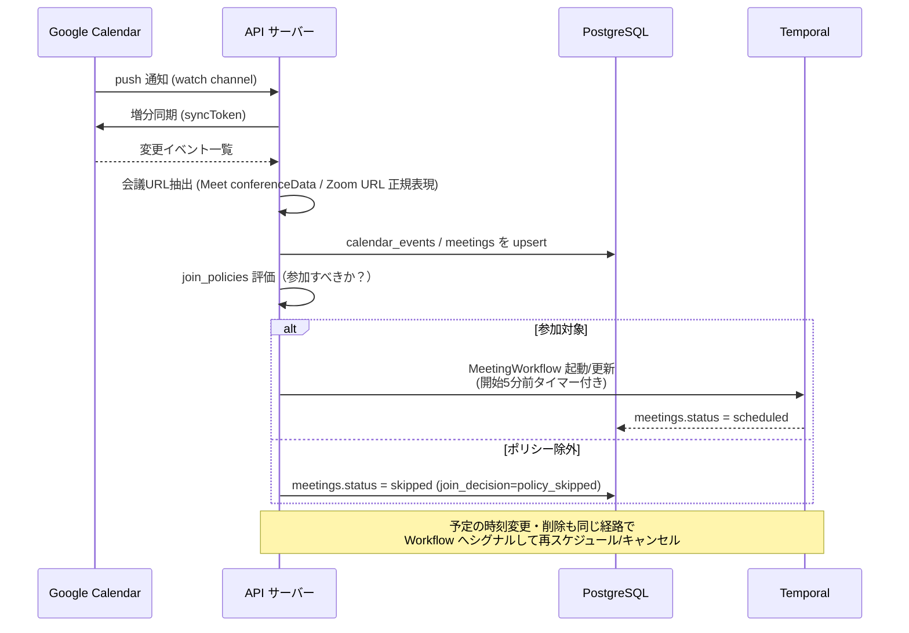
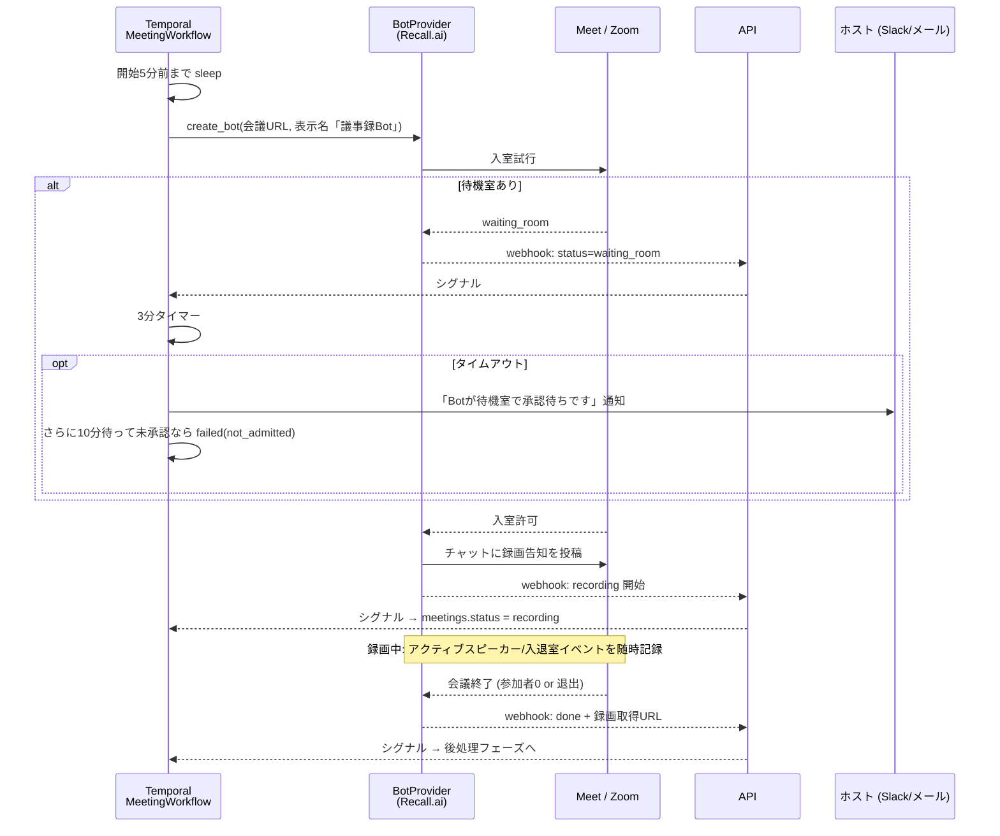
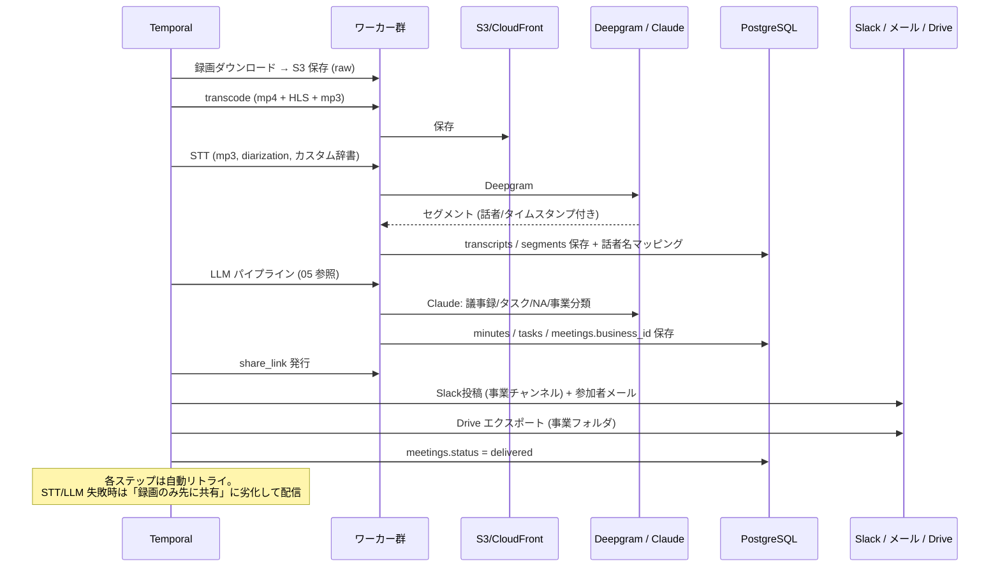
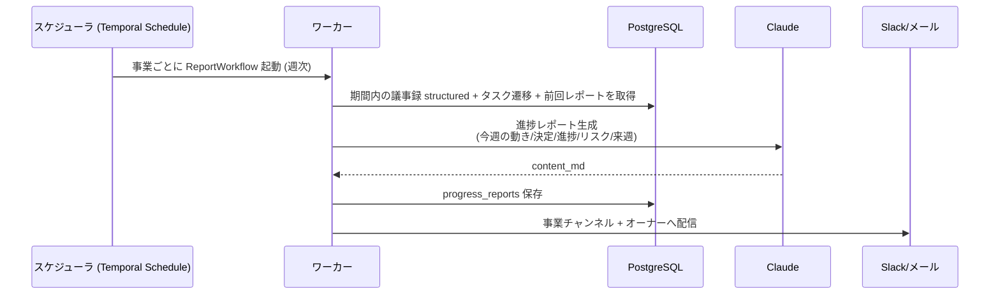
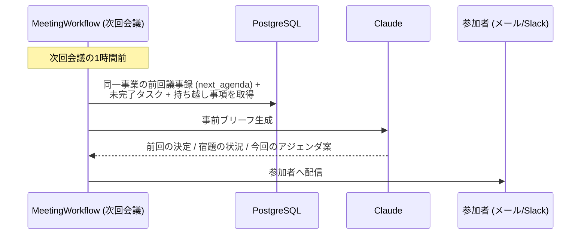

# 04. 主要フロー（シーケンス）

## 1. 会議検知 → 入室予約（予定ベース）

**突発会議（予定なし）**: Zoom は `meeting.started` Webhook で同様に MeetingWorkflow を即時起動する。Google Meet の突発会議は API では検知できないため、フォールバックとして (a) 会議 URL の手動貼り付け、(b) ボット用メールアドレスの招待、を用意する（01 の F-05）。

## 2. 入室 → 録画 → 終了（MeetingWorkflow 前半）

## 3. 後処理 → 配信（MeetingWorkflow 後半）

## 4. 事業進捗レポート（週次バッチ）

## 5. 次回会議の事前ブリーフ（NA の配信）

## 6. 失敗モードと対応（運用設計）

| 失敗 | 検知 | 自動対応 | エスカレーション |
|---|---|---|---|
| 待機室で承認されない | webhook + タイマー | 3分でホスト通知、13分で断念 | 会議ページに「未録画」表示 + 理由 |
| ボットが強制退出させられた | webhook | それまでの録画で後処理続行 | 部分録画である旨を議事録に明記 |
| 会議URLが無効/変更 | 入室エラー | カレンダー再同期 → 新URLで1回リトライ | ホスト通知 |
| STT 失敗 | ワーカー例外 | プロバイダ切替 (Deepgram→Whisper) で再試行 | 録画のみ先に配信、後追いで議事録 |
| LLM 出力がスキーマ不一致 | Zod 検証 | tool use 強制 + 2回リトライ | 議事録なし配信 + 内部アラート |
| 二重入室（同一会議に2ボット） | meetings 一意制約 (conference_url + 時間帯) | Workflow の冪等キーで防止 | — |
| Webhook 欠落 | Workflow 側のポーリング型タイムアウト | Bot 状態を能動取得 | — |
