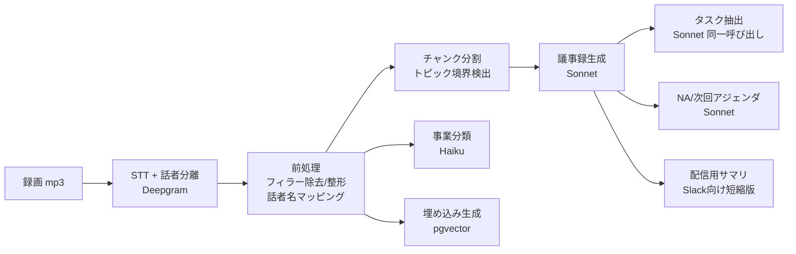

# 05. AI パイプライン設計

## 0. 方針

- **構造化出力を第一級市民に**: 議事録・タスク・NA は全て JSON Schema（tool use）で強制し、Zod で検証してから DB へ。自由文はサマリ Markdown のみ。
- **根拠リンク必須**: LLM の全出力（決定事項・タスク・NA）は `segment_ids`（発言 ID）を必ず伴う。ユーザーは常に「なぜこの結論？」を動画の該当箇所で確認できる。ハルシネーション対策の中核。
- **モデル使い分け**: 議事録・進捗レポート = Claude Sonnet（長文・高品質）、事業分類・話者マッピング補助・軽い整形 = Claude Haiku（低コスト・高速）。
- **日本語前提**: プロンプト・出力フォーマットは日本語。用語辞書（ワークスペース設定）を全プロンプトに注入。

## 1. パイプライン全体



## 2. 各ステージ詳細

### 2.1 STT + 話者分離

- Deepgram `nova-2`（language=ja, diarize=true, smart_format=true, keywords=カスタム辞書）
- 出力: word-level タイムスタンプ + `SPEAKER_nn` ラベル
- **話者名の確定**: ボットのアクティブスピーカーイベント（時刻→参加者名）と diarization 区間を重ね合わせ、一致率が閾値以上なら実名を割当。未確定は「話者A」
- 60 分会議で概ね 1〜2 分で完了。失敗時は Whisper large-v3（self-host or API）へフォールバック

### 2.2 前処理・チャンク分割

- フィラー（「えー」「あのー」）の除去、句読点整形は STT の smart_format + Haiku の軽い後処理
- 長い会議は**トピック境界でチャンク**（発言の埋め込み類似度の谷 + 無音区間で分割）。議事録生成は「チャンクごとの要点抽出 → 全体統合」の 2 段 map-reduce（3 時間会議でもコンテキストに収まる）

### 2.3 議事録生成（コア）

**入力**: 整形済みトランスクリプト、会議メタ（タイトル・参加者・事業名）、同一事業の前回議事録の `next_agenda` と未完了タスク一覧、用語辞書
**出力（tool use で JSON 強制）**:

```jsonc
{
  "summary_md": "## 概要\n...(300字程度)...",
  "decisions":   [{ "text": "LP のファーストビューを○○案で確定", "segment_ids": [123, 128] }],
  "discussions": [{ "topic": "価格設定", "summary": "...", "conclusion": "...", "segment_ids": [...] }],
  "pending":     [{ "text": "広告予算の上限", "reason": "数字待ち", "segment_ids": [...] }],
  "tasks": [{
      "title": "競合LPの調査をまとめる",
      "assignee_name": "田中",          // 参加者リストと突合して user_id 解決
      "due_hint": "来週金曜",           // Haiku で日付正規化 → due_date
      "segment_ids": [201]
  }],
  "next_agenda": [{ "topic": "広告予算の確定", "why": "今回保留のため" }],
  "task_updates": [                     // 前回タスクへの言及検出
      { "task_id": "…", "status_suggestion": "done", "evidence_segment_ids": [88] }
  ]
}
```

**プロンプトの要点**:
- 「発言にないことを書かない。全項目に segment_ids を付けられない場合はその項目を出さない」
- 前回の NA・未完了タスクを渡し、**継続性のある議事録**（前回からの差分がわかる）にする
- 検証: segment_ids が実在するか、assignee が参加者に居るかをコードで検証し、不一致はリトライ or 除外

### 2.4 事業分類（Haiku）

**入力**: 会議タイトル、参加者（メールドメイン）、冒頭 10 分の要約、各事業の `name/description/keywords/related_domains`、過去の分類修正例（few-shot、`classification_feedback` から直近 20 件）
**出力**: `{ business_id | null, confidence: 0-1, reason }`

- `confidence >= 0.8` → 自動割当。`0.5–0.8` → 割当しつつ UI に「自動分類」バッジ + ワンクリック修正。`< 0.5` → 未分類インボックス
- 定例会議（同じ `ical_uid`）は前回の事業を強い事前確率として扱う
- ユーザーの手動修正は `classification_feedback` に保存し、few-shot に自動反映（学習コストゼロの改善ループ）

### 2.5 事業進捗レポート（週次, Sonnet）

**入力**: 期間内の全議事録の `structured`（トランスクリプト全文は渡さない — コスト/精度の両面で要約済み構造データが優る）、タスクの遷移（新規/完了/持ち越し）、前回レポート
**出力（Markdown）**:

```
# {事業名} 週次進捗 (7/13 - 7/19)
## 今週の動き        … 会議 3 件のハイライト
## 決定事項          … 各項目に会議リンク
## 進捗              … 完了タスク n 件 / 新規 n 件 / 持ち越し n 件（要注意の停滞タスクを明示）
## リスク・懸念      … 保留が続いている論点、期限超過タスク
## 来週やること      … NA の集約
```

- 「リスク」は機械的にも補強: 2 回以上持ち越されたタスク、2 週連続で保留の論点はコードで検出してプロンプトに明示的に渡す

### 2.6 事前ブリーフ（次回会議 1 時間前, Sonnet）

前回議事録 + タスク消化状況から「前回の決定 / 宿題ステータス / 今回のアジェンダ案」を A4 半分程度で生成し、参加者に配信（04 のフロー 5）。

## 3. コスト概算（60 分会議 1 件あたり）

| 項目 | 概算 |
|---|---|
| ボット + 録画（Recall.ai） | ~$0.7–1.0 |
| STT（Deepgram, 60分） | ~$0.3–0.5 |
| Claude（議事録 Sonnet 約 25k in / 3k out + 分類 Haiku） | ~$0.15–0.25 |
| S3/CDN/転送 | ~$0.05 |
| **合計変動費** | **~$1.2–1.8 / 会議時間** |

月 100 時間録画のワークスペースで変動費 ~$120–180/月 → 価格設計の下限根拠になる（06 参照）。内製ボット移行で $0.7–1.0 → ~$0.1 に圧縮可能。

## 4. 品質評価（Eval）

- **ゴールデンセット**: 実会議 20 件（社内会議で作成）に人手の正解議事録・タスクを付与し、プロンプト変更ごとに回帰評価
- 指標: 決定事項の再現率/適合率、タスクの担当者・期限の正解率、事業分類の正解率、segment_ids の妥当性（根拠が実際にその内容を含むか = LLM-as-judge）
- 本番フィードバック: 議事録の手動編集差分・タスク修正・分類修正を毎週集計し、プロンプト改善のバックログにする
